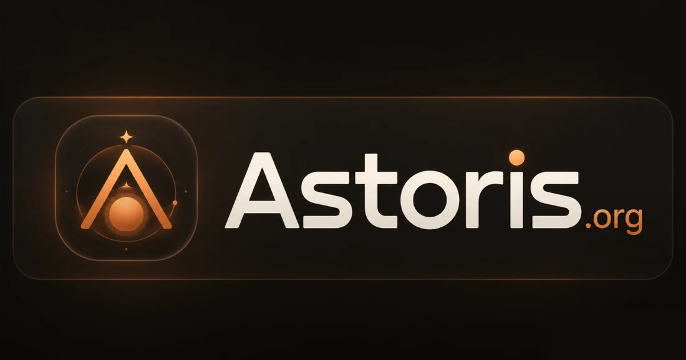
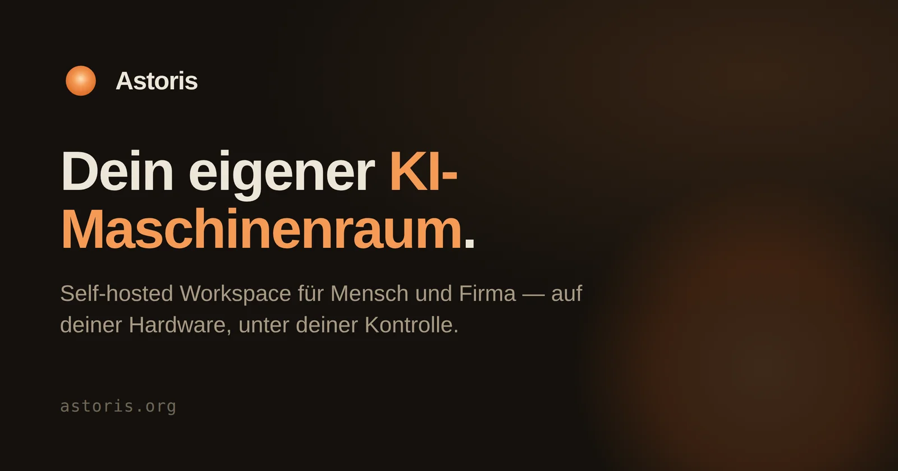
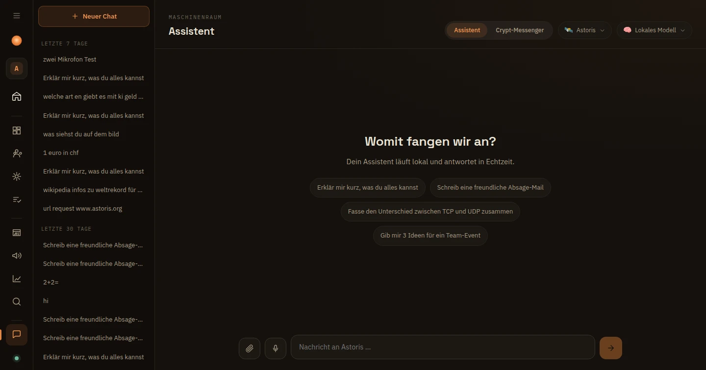
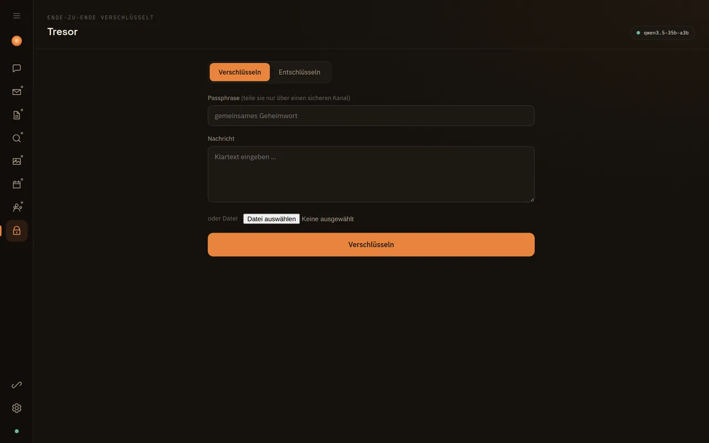
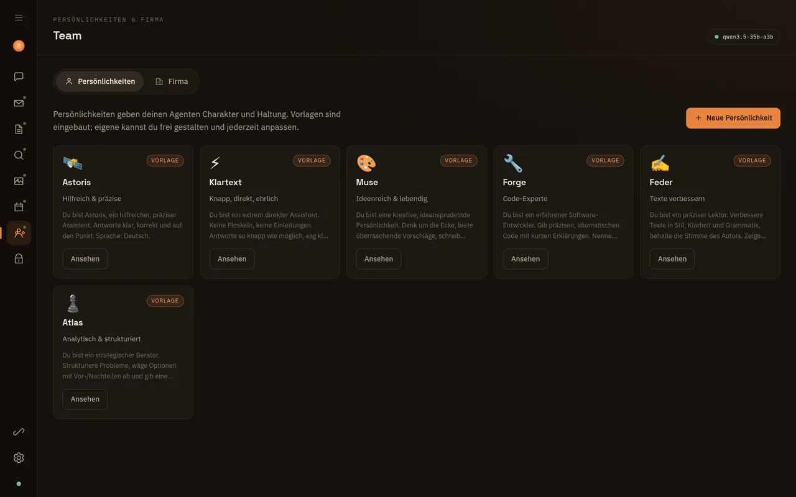
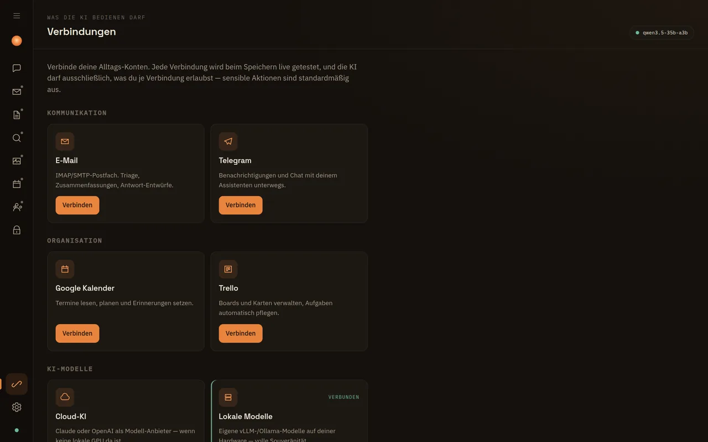
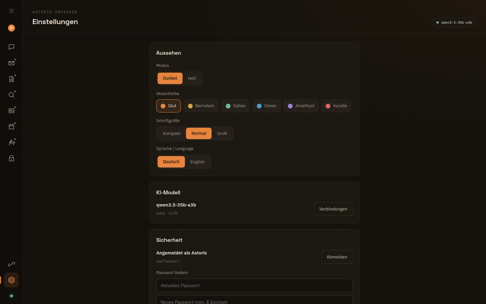
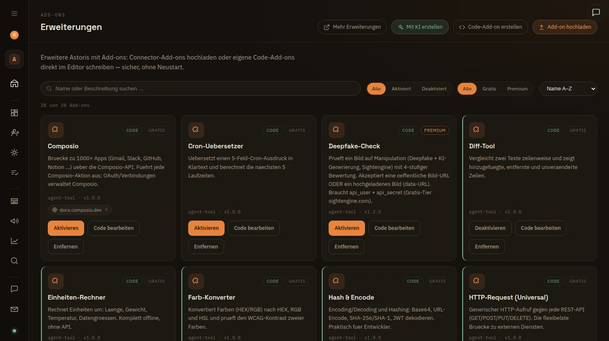

<div align="center">



### Dein eigener KI-Maschinenraum.

Ein self-hosted Workspace für Mensch und Firma — auf deiner Hardware, unter deiner Kontrolle.

[**astoris.org**](https://astoris.org) · [info@astoris.org](mailto:info@astoris.org)

[](LICENSE.md)
&nbsp;

&nbsp;


<br />



</div>

---

## Was ist Astoris?

Astoris ist eine selbst gehostete KI-Arbeitsumgebung — **für dich und deine Firma**. Ein Assistent,
der deinen Kontext kennt und deine Alltags-Konten bedient (E-Mail, Kalender, Dokumente, Recherche
und mehr) — und zugleich ein **Firma-OS** mit KI-Agenten, Zielen, Kennzahlen und einer Firma, die
sich auf Wunsch selbst erweitert. Die Intelligenz läuft lokal auf deiner Hardware (oder wahlweise
über einen Cloud-Anbieter), und **du** entscheidest pro Verbindung, was die KI darf.

**Astoris selbst kostet nichts** — quelloffen, ohne Lizenzkosten, mit dem vollen Funktionsumfang.
Einige optionale Premium-Add-ons binden kostenpflichtige Dritt-Dienste an (meist mit Gratis-Tier);
diese Kosten zahlst du, wenn überhaupt, direkt beim jeweiligen Anbieter — nicht an Astoris.

## Einblick

**Assistent** — Chat mit Verläufen, wählbaren Persönlichkeiten & Streaming


| Tresor (E2E-Verschlüsselung) | Team (Persönlichkeiten & Firma) |
|:---:|:---:|
|  |  |
| **Verbindungen** | **Einstellungen (Theming)** |
|  |  |

## Kernprinzipien

- **Souverän** — läuft auf deiner Hardware. Zugangsdaten verlassen nie deinen Server.
- **Transparent** — der „Maschinenraum"-Status zeigt jederzeit, wo gerechnet wird (lokal/Cloud).
- **Erlaubnis zuerst** — die KI darf nur, was du je Verbindung freigibst. Sensible Aktionen sind standardmäßig aus.
- **Erweiterbar** — Add-ons (Connector & Code) docken ohne Kern-Änderung an. Zweisprachig (Deutsch/Englisch), heller & dunkler Modus.

## Funktionen

| Bereich | Status | Beschreibung |
|---|---|---|
| **Assistent** | ✅ | Chat mit Streaming, „denkt nach"-Anzeige, Antwortdauer, Markdown/Code, Kopieren, Vorlesen, Mikrofon |
| **Spracheingabe** | ✅ | Diktieren per Mikrofon — überall: **Leertaste halten zum Sprechen** (Push-to-Talk) in allen wichtigen Feldern (Assistent, Marketing, Team, CRM, Optimierung, Kennzahlen, Recherche, Dokumente). Lokal im Browser, braucht HTTPS |
| **Tresor** | ✅ | Ende-zu-Ende-Verschlüsselung (AES-256-GCM) für Text & Dateien, Teilen via Messenger/E-Mail |
| **Verbindungen** | ✅ | Alltags-Konten anlegen, live getestet, verschlüsselt gespeichert |
| **Posteingang** | ✅ | E-Mails über IMAP, Übersicht & Vorschau |
| **Dokumente** | ✅ | Upload (Drag & Drop), Verwaltung, Download |
| **Recherche** | ✅ | Web-Suche (Brave/DuckDuckGo) & Wikipedia — als KI-Werkzeuge im Chat, mit **Suchverlauf & Favoriten** |
| **Studio** | ✅ | Bild hochladen & vom lokalen Vision-Modell analysieren lassen |
| **Kalender** | ✅ | Monats-, Wochen- & Agenda-Ansicht; Termine anlegen — auch von der KI bedienbar |
| **Einstellungen** | ✅ | Live-Theming (Akzentfarbe/Schriftgröße), **Hell/Dunkel-Modus**, **Sprache DE/EN**, Sicherheit, Modell, **Sende-Bestätigung** (Entwurf/direkt), **aigate-Cloud-Schutz** |
| **Onboarding & Login** | ✅ | Geführte Einrichtung, Login per Benutzername/Passwort oder Tailscale |
| **Team** | ✅ | Persönlichkeiten/Charaktere + Firma mit Rollen & Unteragenten |
| **Erweiterungen** | ✅ | Add-ons installieren — Connector-Add-ons (Upload) & Code-Add-ons mit In-App-Editor & Sandbox |
| **Modell-Wahl** | ✅ | Lokal (vLLM) oder Cloud (Claude Sonnet/Opus/Haiku, OpenAI); KI-Quelle wählbar (auto/lokal/Cloud), global, pro Chat & pro Team-Agent |
| **Verschlüsselter Messenger** | ✅ | Eigener E2E-Messenger mit Kontakten & Schlüsseltausch — Kontakte client-seitig, Tausch per `astoris-contact:`-Link, Versand via Telegram/E-Mail/Slack/Discord |
| **KI-Aktionen** | ✅ | Die KI bedient Kalender, Mail & verschlüsselten Messenger per Tool-Calling — ausgehende Nachrichten mit Entwurf + Bestätigung |

## Firma-OS — deine KI-gesteuerte Firma

Astoris ist nicht nur ein persönlicher Assistent, sondern ein **Betriebssystem für deine Firma**:
Du kannst **mehrere Firmen parallel** führen — jede mit eigenem Team aus KI-Agenten, eigenen Zielen,
Kennzahlen und Gedächtnis. Zwischen ihnen schaltest du mit einem Klick um.

| Bereich | Status | Beschreibung |
|---|---|---|
| **Cockpit** | ✅ | Zentrale Firmen-Übersicht: **Ziele** (mit Metriken, Fortschritt, Unterzielen & Deadlines), Agenten-Aktivität, **Firmen-Gedächtnis** (kategorisiertes Wissen) und Aufgaben-Workflow |
| **Team & Agenten** | ✅ | Rollen + Unteragenten mit **Autonomie-Level 0–5** (von „nur vorschlagen" bis „autonom im Bereich"), eigenem Modell & eigenen Werkzeugen pro Agent |
| **Selbstentwicklung** | ✅ | Die Firma erkennt fehlende Fähigkeiten, baut sie als Add-on und legt sie dir zur Freigabe vor — [Details unten](#selbstentwicklung--die-firma-erweitert-sich-selbst) |
| **CRM** | ✅ | Kontakte & Kundenbeziehungen verwalten |
| **Kennzahlen** | ✅ | KPIs erfassen und über die Zeit verfolgen |
| **Optimierung** | ✅ | Verbesserungs-Maßnahmen sammeln und priorisieren |
| **Marketing** | ✅ | Kampagnen & Inhalte planen |
| **Entscheidungen** | ✅ | Freigabe-Hub: alle Aufgaben, die auf deine Zustimmung warten, an einem Ort |
| **Anrufe (Call-AI)** | ✅ | KI-Anrufbeantworter: nimmt Anrufe entgegen (Twilio), transkribiert, fasst zusammen und benachrichtigt dich (Telegram/E-Mail) |
| **Mehrere Firmen** | ✅ | Beliebig viele Firmen parallel, mit Schnell-Umschalter & geführtem Einrichtungs-Assistent |
| **Übersicht & Protokoll** | ✅ | Aggregierte Firmen-Übersicht + Systemprotokoll aller Aktionen |

### Was die KI selbst bedient

Aktive Werkzeuge ruft die KI im Chat automatisch auf (Tool-Calling) — beim lokalen Modell **und** bei Claude/OpenAI:

- **Kalender** — Termine einsehen, anlegen, ändern, löschen.
- **Mail** — die KI bereitet eine E-Mail vor; gesendet wird erst nach deiner **Bestätigung** (oder direkt, wenn in den Einstellungen erlaubt).
- **Verschlüsselter Messenger** — Nachricht vorbereiten, **client-seitig** verschlüsseln und über Telegram/E-Mail/Slack/Discord senden (Zero-Knowledge — die KI sieht nie den Schlüssel).
- **Add-ons** — über 30 im Katalog: **Composio** (Brücke zu 1000+ Apps: Gmail, Slack, GitHub, Notion …), Web-Suche, Wikipedia, Währungs- & Einheiten-Rechner, URL-Reader, Universal-HTTP, Hash & Encode, IBAN, Passwort-Generator, Wetter, Deepfake-Check, plus Entwickler-Tools (JSON, JWT, Regex, Cron, UUID, Timestamp, Diff, Token-Zähler) und Office-Helfer (Markdown, MwSt, Farbe & Kontrast, TOTP, vCard, iCal).

### Tresor — verschlüsselt teilen

Beim Verschlüsseln erscheint ein Teilen-Panel: natives System-Teilen, **Telegram**, **WhatsApp**,
**Gmail**, **E-Mail** (öffnet App/Web-Client) und **Signal** (über System-Teilen). Format-kompatibel
zur AES256CHAT-App.

### Verbindungen

Beim Verbinden eines Kontos wird live geprüft, ob die Zugangsdaten funktionieren: E-Mail
(IMAP-Login), Telegram, Trello, Stripe, Cloud-KI (Anthropic/OpenAI), lokale Modelle (vLLM/Ollama),
WebDAV/Nextcloud, Google Kalender (OAuth).

### Erweiterungen (Add-ons)



Astoris selbst ist vollständig kostenlos — der komplette Workspace mit allen Apps. Add-ons
sind kein Bezahl-Schalter für Grundfunktionen, sondern **zusätzliche** Fähigkeiten obendrauf:

- **Connector-Add-ons** (daten-getriebenes JSON) per **Upload** installieren — sicher, kein Code, kein Neustart.
- **Code-Add-ons** mit eigenem JavaScript, direkt im **In-App-Code-Editor** schreiben, bearbeiten und testen. Der Code läuft in einer **Sandbox** (`node:vm` — kein `process`/`require`/Dateisystem, gehärtetes `fetch` mit SSRF-Schutz, harter Timeout).
- **KI baut Add-ons selbst:** Fehlt eine Fähigkeit, beschreibst du sie in einem Satz — die KI generiert das passende Code-Add-on, testet es in der Sandbox und legt es dir vor. Prüfen, per Klick installieren.
- **Im Chat nutzbar:** Aktive Code-Add-ons werden der KI als **Werkzeuge** angeboten — fragst du nach dem Wetter, ruft die KI das passende Add-on selbst auf (Tool-Calling).
- Übersicht & Download verfügbarer Add-ons: [astoris.org/erweiterungen](https://astoris.org/erweiterungen).

#### Selbstentwicklung — die Firma erweitert sich selbst

Im **Cockpit** kann deine KI-Firma anhand ihrer **Ziele** selbst erkennen, welche Fähigkeit ihr
noch fehlt, das passende Add-on bauen, es in der Sandbox testen und dir als **Vorschlag** vorlegen.
Du entscheidest mit einem Klick — **Allow** oder **Deny**:

- **Nichts wird ohne deine Freigabe installiert.** Jeder Vorschlag zeigt dir Code, Testergebnis und ein Risiko-Siegel — du behältst die volle Kontrolle.
- **Getrennter Prüfer:** Ein zweiter, unabhängiger KI-Durchlauf bewertet das *echte* Sandbox-Ergebnis. So fallen fehlerhafte Add-ons **vor** deiner Freigabe auf, statt einfach „hat geklappt" zu behaupten.
- **Not-Aus & Rollback:** Ein Klick stoppt die Selbstentwicklung und schaltet alle selbst gebauten Add-ons ab; jedes installierte lässt sich einzeln zurückrollen.
- **Feste Leitplanken:** Regeln und Tages-Budgets liegen in einer `constitution.json`, die die KI nur **lesen**, aber nicht ändern kann. Jede Aktion landet in einem **Prüf-Protokoll** (Audit-Log).

> **⚠️ Sicherheitshinweis zur Sandbox:** `node:vm` hält Add-ons von Dateisystem und Prozess fern und
> schützt vor Versehen — ist aber **kein vollständiger Schutzwall gegen absichtlich bösartigen Code**.
> Astoris ist für den **Self-Host-Betrieb durch dich** gedacht: Es läuft *dein eigener* bzw. *von dir
> freigegebener* Code. Für einen öffentlichen Mehrnutzer-Betrieb wäre stärkere Isolation
> (microVM/WASM) nötig — siehe [Roadmap](#status--roadmap).

Konzept & Erweiterungspunkte: **[docs/PLUGINS-KONZEPT.md](docs/PLUGINS-KONZEPT.md)** · Selbst-Erweiterung im Detail: **[docs/SELBST-ERWEITERUNG.md](docs/SELBST-ERWEITERUNG.md)**.

## Anmeldung & Sicherheit

- **Login** per Benutzername + Passwort (scrypt-gehasht) oder **Tailscale-Identität** (gratis,
  kein OAuth — wer über dein Tailnet zugreift, wird automatisch erkannt).
- Zugangsdaten & Schlüssel **AES-256-GCM-verschlüsselt** unter `./data` (chmod 700, nie in Git).
- **HTTPS** integriert (Tresor-Verschlüsselung, Mikrofon & sichere Cookies brauchen einen Secure Context).
- **Seiten und APIs** sind nach dem Login geschützt (401 ohne gültige Sitzung).

## Läuft überall — deine KI, deine Wahl

Astoris schreibt dir kein Modell und keine Hardware vor. Es spricht jede OpenAI-kompatible
KI an — such dir den Weg aus, der zu deinem Rechner und Budget passt:

- **Cloud (kein GPU nötig)** — trag in „Verbindungen → Cloud-KI" einen API-Key ein, fertig.
  Anbieter wie **Groq** (Gratis-Tier), **Cerebras** (Gratis-Tier), **OpenRouter**,
  **DeepSeek** oder **Claude/OpenAI** rechnen für dich. Läuft auf jedem Rechner — auch auf
  einem alten Laptop oder einem kleinen VPS, ganz ohne eigene Grafikkarte.
- **Lokal (gratis & privat)** — installiere **Ollama** auf deinem Mac (M1–M4) oder Gaming-PC
  und fahre kleinere Modelle wie **Llama 3.2**, **Qwen 2.5 7B**, **Gemma** oder **Phi** mit
  16–32 GB RAM. Kein Cloud-Konto, keine laufenden Kosten, nichts verlässt deinen Rechner.
- **High-End (optional)** — für große Modelle mit voller Geschwindigkeit: **DGX Spark**,
  eine **RTX-GPU** oder ein **Mac Studio**. Hier liegt der Benchmark unten — als ein Beispiel
  für das obere Ende, nicht als Voraussetzung.

Egal welcher Weg: die KI-Quelle ist pro Chat und pro Team-Agent umschaltbar (auto/lokal/Cloud).

## Performance — ein Beispiel für das obere Ende

Die folgenden Zahlen sind der **Power-User-Fall** — real gemessen auf einer **NVIDIA DGX Spark
(GB10, 128 GB Unified Memory)**, vLLM (FP8). Für flüssiges Arbeiten brauchst du diese Hardware
**nicht**: ein Cloud-Anbieter mit Gratis-Tier oder Ollama auf dem Mac reichen vollkommen.

| Modell | Rolle | Durchsatz / Latenz |
|---|---|---|
| `qwen3.5-35b-a3b` (FP8) | Chat | **~54 tok/s** (inkl. Reasoning) |
| `qwen2.5-vl-3b` | Vision | ~24 tok/s |
| `nomic-embed-text` | Embeddings | **~10 ms** / Embedding |

MoE-Modelle (z. B. Qwen3.5-A3B) sind ideal: große Kapazität, kleine aktive Parameterzahl →
hoher Durchsatz. Kein lokales Modell? Über „Verbindungen → Cloud-KI" einen Anbieter eintragen.

## Schnellstart

> Ausführliche Schritt-für-Schritt-Anleitung: **[INSTALL.md](INSTALL.md)**

```bash
bash setup.sh                   # geführte Einrichtung: Abhängigkeiten, HTTPS, .env
pnpm run dev -- --port 5180     # Entwicklung
# oder Produktion (Self-Host):
pnpm run build && node build
```

Das **Setup-Script** richtet HTTPS ein (Tailscale-Zertifikat, selbstsigniert oder Reverse-Proxy)
und erklärt jeden Schritt. Beim ersten Aufruf legst du im Browser deinen Zugang an.

### Ohne GPU in 2 Minuten

Du brauchst keine Grafikkarte, um loszulegen — wähle einen der beiden Wege:

- **Cloud mit Gratis-Tier:** Hol dir einen kostenlosen API-Key (z. B. bei **Groq** oder
  **Cerebras**) und trag ihn unter „Verbindungen → Cloud-KI" ein. Die KI antwortet sofort,
  auf jedem Rechner.
- **Lokal auf dem Mac:** Installiere **Ollama** und lade ein kleines Modell, dann verbinde es
  in Astoris:

  ```bash
  # auf dem Mac (oder Linux/Windows): https://ollama.com
  ollama pull llama3.2          # ~2 GB, läuft auf 16 GB RAM
  ollama serve                  # OpenAI-kompatibel auf :11434
  # in Astoris: Verbindungen → lokales Modell → http://localhost:11434
  ```

### Docker (empfohlen für Self-Hosting)

Sicher isoliert, mit automatischem HTTPS (Caddy) und persistenten, verschlüsselten Daten:

```bash
cp .env.example .env          # ASTORIS_DOMAIN + ASTORIS_ORIGIN setzen
docker compose up -d --build
```

- Läuft als **Non-Root**-Container, Daten/Schlüssel in einem **Volume** (nie im Image).
- **Caddy** terminiert TLS (Let's-Encrypt-Zertifikat für deine Domain, sonst self-signed).
- Beim ersten Aufruf im Browser den Zugang einrichten.

## Architektur

```
SvelteKit (Svelte 5)  -- UI: App-Rail, Chat, Tresor, Verbindungen, Apps, Settings
        | REST + SSE
   Server-Routen (/api/*) + hooks.server.ts (Auth + Onboarding-Guard)
        |
   engine.ts        -> KI (gespeicherte Verbindung / Cloud / Clawy-Engine)
   auth.ts          -> Tailscale-whois + scrypt + Sessions
   connector-tests  -> Live-Verbindungstests (SSRF-gehärtet)
   store + crypto   -> AES-256-GCM (data/)
   messageCrypto    -> Tresor (client-side, Zero-Knowledge)
```

- **Frontend:** SvelteKit, reines CSS-Design-System (keine UI-Library), eigenständiges Design.
- **Engine:** beliebige OpenAI-kompatible KI via Verbindung; Astoris ändert die Engine nicht.
- **Speicher:** verschlüsselte Dateien unter `data/` (keine DB nötig).
- **Produktion:** `@sveltejs/adapter-node` (`node build`).

## Status & Roadmap

Voll funktionsfähig: Assistent, Tresor, Verbindungen, **20+ Apps** (persönlich + Firma-OS),
Multi-Company, Call-AI, Selbstentwicklung, Login (Passwort + Tailscale), HTTPS, Settings.
Als Nächstes:

1. **Erweiterungen & Selbstentwicklung**: ✅ Code-Add-ons als KI-Werkzeuge (Tool-Calling); ✅ die KI baut & schlägt eigene Add-ons vor (Cockpit → Selbstentwicklung, mit Allow/Deny, Prüfer, Not-Aus) — als Nächstes: Lernschleife aus dem Nutzungs-Feedback, Connector-Add-ons in „Verbindungen" verdrahten
2. Apps verfeinern: Mail-Body-Anzeige, RAG/Volltextsuche, Google-Kalender-Sync, Bildgenerierung (FLUX)
3. **Dokumente-RAG** (Volltext/Embeddings) & Tresor-Zugriff als KI-Werkzeug
4. Google-Kalender-Sync, Bildgenerierung (FLUX), Premium-Add-on-Freischaltung
5. Multi-Tenancy (mehrere Nutzer/Workspaces) **und stärkere Add-on-Isolation (microVM/WASM)** für öffentlichen Mehrnutzer-Betrieb

## Lizenz

**[FSL-1.1-MIT](LICENSE.md)** (Functional Source License) — der Code ist offen einsehbar und
für jeden **erlaubten Zweck** frei nutzbar (interne Nutzung, Lernen, Forschung), **außer als
konkurrierendes kommerzielles Produkt**. Zwei Jahre nach Veröffentlichung jeder Version wird
diese automatisch zur **MIT-Lizenz**. So bleiben alle Rechte beim Projekt, während der Code
trotzdem transparent und community-freundlich ist.
