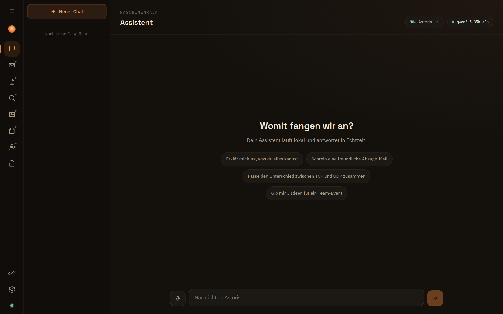
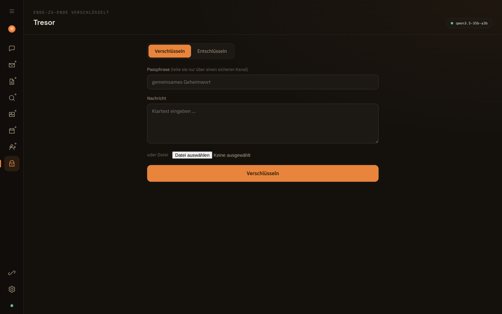
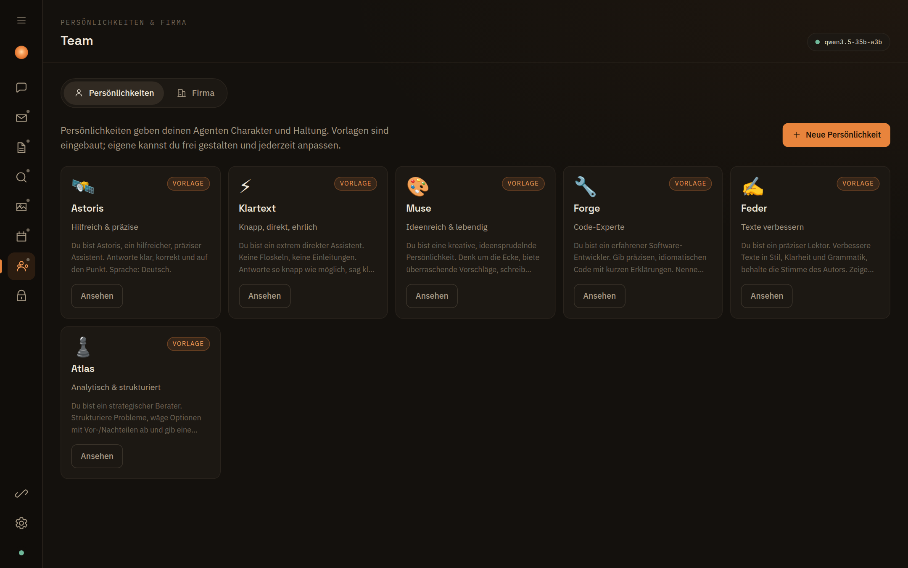
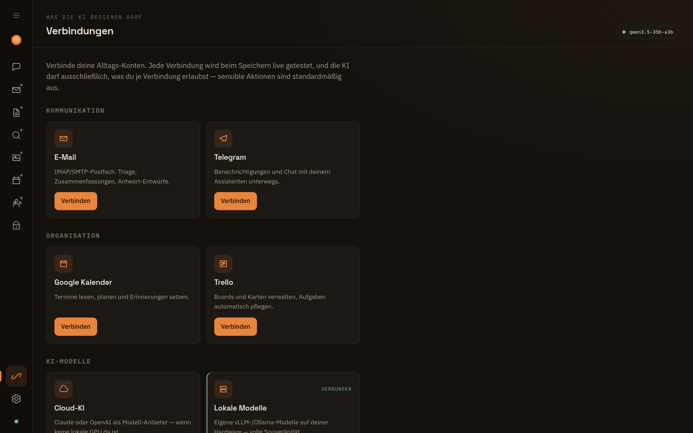
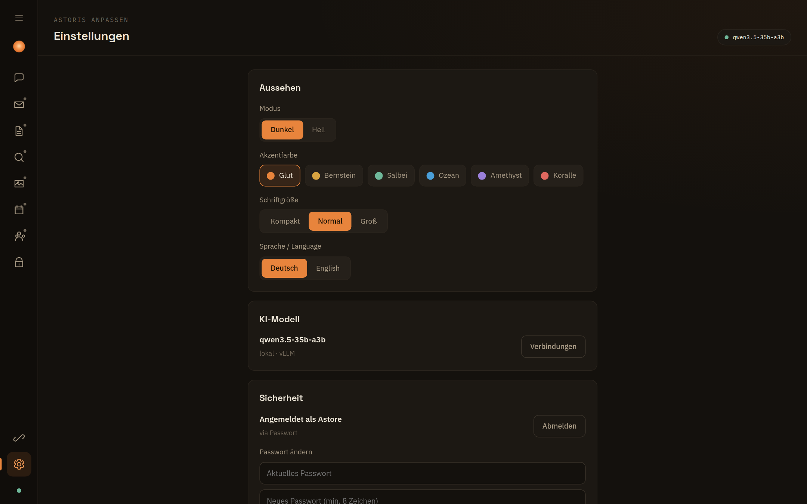

<div align="center">


### Dein eigener KI-Maschinenraum.

Ein self-hosted Workspace für Mensch und Firma — auf deiner Hardware, unter deiner Kontrolle.

[**astoris.org**](https://astoris.org) · [info@astoris.org](mailto:info@astoris.org)

<br />


</div>

---

## Was ist Astoris?

Astoris ist eine selbst gehostete KI-Arbeitsumgebung. Ein Assistent, der deinen Kontext kennt
und deine Alltags-Konten bedient — E-Mail, Kalender, Dokumente, Recherche und mehr. Die
Intelligenz läuft lokal auf deiner Hardware (oder wahlweise über einen Cloud-Anbieter), und
**du** entscheidest pro Verbindung, was die KI darf.

## Einblick

**Assistent** — Chat mit Verläufen, wählbaren Persönlichkeiten & Streaming


| Tresor (E2E-Verschlüsselung) | Team (Persönlichkeiten & Firma) |
|:---:|:---:|
|  |  |
| **Verbindungen** | **Einstellungen (Theming)** |
|  |  |

## Kernprinzipien

- **Souverän** — läuft auf deiner Hardware. Zugangsdaten verlassen nie deinen Server.
- **Transparent** — der „Maschinenraum"-Status zeigt jederzeit, wo gerechnet wird (lokal/Cloud).
- **Erlaubnis zuerst** — die KI darf nur, was du je Verbindung freigibst. Sensible Aktionen sind standardmäßig aus.
- **Erweiterbar** — Add-ons (Connector & Code) docken ohne Kern-Änderung an. Zweisprachig (Deutsch/Englisch), heller & dunkler Modus.

## Funktionen

| Bereich | Status | Beschreibung |
|---|---|---|
| **Assistent** | ✅ | Chat mit Streaming, „denkt nach"-Anzeige, Antwortdauer, Markdown/Code, Kopieren, Vorlesen, Mikrofon |
| **Tresor** | ✅ | Ende-zu-Ende-Verschlüsselung (AES-256-GCM) für Text & Dateien, Teilen via Messenger/E-Mail |
| **Verbindungen** | ✅ | Alltags-Konten anlegen, live getestet, verschlüsselt gespeichert |
| **Posteingang** | ✅ | E-Mails über IMAP, Übersicht & Vorschau |
| **Dokumente** | ✅ | Upload (Drag & Drop), Verwaltung, Download |
| **Recherche** | ✅ | Web-Suche (DuckDuckGo) mit Trefferliste |
| **Studio** | ✅ | Bild hochladen & vom lokalen Vision-Modell analysieren lassen |
| **Kalender** | ✅ | Monatsansicht, Termine anlegen (Google-Sync folgt) |
| **Einstellungen** | ✅ | Live-Theming (Akzentfarbe/Schriftgröße), **Hell/Dunkel-Modus**, **Sprache DE/EN**, Sicherheit, Modell |
| **Onboarding & Login** | ✅ | Geführte Einrichtung, Login per Benutzername/Passwort oder Tailscale |
| **Team** | ✅ | Persönlichkeiten/Charaktere + Firma mit Rollen & Unteragenten |
| **Erweiterungen** | ✅ | Add-ons installieren — Connector-Add-ons (Upload) & Code-Add-ons mit In-App-Editor & Sandbox |

### Tresor — verschlüsselt teilen

Beim Verschlüsseln erscheint ein Teilen-Panel: natives System-Teilen, **Telegram**, **WhatsApp**,
**Gmail**, **E-Mail** (öffnet App/Web-Client) und **Signal** (über System-Teilen). Format-kompatibel
zur AES256CHAT-App.

### Verbindungen

Beim Verbinden eines Kontos wird live geprüft, ob die Zugangsdaten funktionieren: E-Mail
(IMAP-Login), Telegram, Trello, Stripe, Cloud-KI (Anthropic/OpenAI), lokale Modelle (vLLM/Ollama),
WebDAV/Nextcloud, Google Kalender (OAuth).

### Erweiterungen (Add-ons)

Der Kern ist gratis — neue Fähigkeiten kommen als Add-ons:

- **Connector-Add-ons** (daten-getriebenes JSON) per **Upload** installieren — sicher, kein Code, kein Neustart.
- **Code-Add-ons** mit eigenem JavaScript, direkt im **In-App-Code-Editor** schreiben, bearbeiten und testen. Der Code läuft in einer **Sandbox** (`node:vm` — kein `process`/`require`/Dateisystem, mit Timeout).
- **Im Chat nutzbar:** Aktive Code-Add-ons werden der KI als **Werkzeuge** angeboten — fragst du nach dem Wetter, ruft die KI das passende Add-on selbst auf (Tool-Calling).
- Übersicht & Download verfügbarer Add-ons: [astoris.org/erweiterungen](https://astoris.org/erweiterungen).

Konzept & Erweiterungspunkte: **[docs/PLUGINS-KONZEPT.md](docs/PLUGINS-KONZEPT.md)**.

## Anmeldung & Sicherheit

- **Login** per Benutzername + Passwort (scrypt-gehasht) oder **Tailscale-Identität** (gratis,
  kein OAuth — wer über dein Tailnet zugreift, wird automatisch erkannt).
- Zugangsdaten & Schlüssel **AES-256-GCM-verschlüsselt** unter `./data` (chmod 700, nie in Git).
- **HTTPS** integriert (Tresor-Verschlüsselung, Mikrofon & sichere Cookies brauchen einen Secure Context).
- **Seiten und APIs** sind nach dem Login geschützt (401 ohne gültige Sitzung).

## Lokale Modelle — Performance

Real gemessen auf einer **NVIDIA DGX Spark (GB10, 128 GB Unified Memory)**, vLLM (FP8):

| Modell | Rolle | Durchsatz / Latenz |
|---|---|---|
| `qwen3.5-35b-a3b` (FP8) | Chat | **~54 tok/s** (inkl. Reasoning) |
| `qwen2.5-vl-3b` | Vision | ~24 tok/s |
| `nomic-embed-text` | Embeddings | **~10 ms** / Embedding |

MoE-Modelle (z. B. Qwen3.5-A3B) sind ideal: große Kapazität, kleine aktive Parameterzahl →
hoher Durchsatz. Kein lokales Modell? Über „Verbindungen → Cloud-KI" einen Anbieter eintragen.

## Schnellstart

> Ausführliche Schritt-für-Schritt-Anleitung: **[INSTALL.md](INSTALL.md)**

```bash
bash setup.sh                   # geführte Einrichtung: Abhängigkeiten, HTTPS, .env
pnpm run dev -- --port 5180     # Entwicklung
# oder Produktion (Self-Host):
pnpm run build && node build
```

Das **Setup-Script** richtet HTTPS ein (Tailscale-Zertifikat, selbstsigniert oder Reverse-Proxy)
und erklärt jeden Schritt. Beim ersten Aufruf legst du im Browser deinen Zugang an.

### Docker (empfohlen für Self-Hosting)

Sicher isoliert, mit automatischem HTTPS (Caddy) und persistenten, verschlüsselten Daten:

```bash
cp .env.example .env          # ASTORIS_DOMAIN + ASTORIS_ORIGIN setzen
docker compose up -d --build
```

- Läuft als **Non-Root**-Container, Daten/Schlüssel in einem **Volume** (nie im Image).
- **Caddy** terminiert TLS (Let's-Encrypt-Zertifikat für deine Domain, sonst self-signed).
- Beim ersten Aufruf im Browser den Zugang einrichten.

## Architektur

```
SvelteKit (Svelte 5)  -- UI: App-Rail, Chat, Tresor, Verbindungen, Apps, Settings
        | REST + SSE
   Server-Routen (/api/*) + hooks.server.ts (Auth + Onboarding-Guard)
        |
   engine.ts        -> KI (gespeicherte Verbindung / Cloud / Clawy-Engine)
   auth.ts          -> Tailscale-whois + scrypt + Sessions
   connector-tests  -> Live-Verbindungstests (SSRF-gehärtet)
   store + crypto   -> AES-256-GCM (data/)
   messageCrypto    -> Tresor (client-side, Zero-Knowledge)
```

- **Frontend:** SvelteKit, reines CSS-Design-System (keine UI-Library), eigenständiges Design.
- **Engine:** beliebige OpenAI-kompatible KI via Verbindung; Astoris ändert die Engine nicht.
- **Speicher:** verschlüsselte Dateien unter `data/` (keine DB nötig).
- **Produktion:** `@sveltejs/adapter-node` (`node build`).

## Status & Roadmap

MVP läuft: Chat, Tresor, Verbindungen, 5 Apps, Login (Passwort + Tailscale), HTTPS, Settings.
Als Nächstes:

1. **Erweiterungen**: ✅ Code-Add-ons als KI-Werkzeuge im Chat (Tool-Calling) — als Nächstes: Connector-Add-ons in „Verbindungen" verdrahten, Premium-Lizenz-Freischaltung
2. Apps verfeinern: Mail-Body-Anzeige, RAG/Volltextsuche, Google-Kalender-Sync, Bildgenerierung (FLUX)
3. Agenten der Firma echte Aufgaben bearbeiten lassen (Orchestrierung)
4. Multi-Tenancy (mehrere Nutzer/Workspaces) für öffentlichen Mehrnutzer-Betrieb

## Lizenz

**[FSL-1.1-MIT](LICENSE.md)** (Functional Source License) — der Code ist offen einsehbar und
für jeden **erlaubten Zweck** frei nutzbar (interne Nutzung, Lernen, Forschung), **außer als
konkurrierendes kommerzielles Produkt**. Zwei Jahre nach Veröffentlichung jeder Version wird
diese automatisch zur **MIT-Lizenz**. So bleiben alle Rechte beim Projekt, während der Code
trotzdem transparent und community-freundlich ist.
